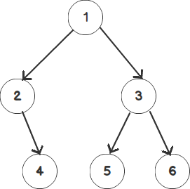

### 1、概念

二叉树：如图，子节点至多为一个左节点和一个右节点的树
```java
public class TreeNode {
    int val;
    TreeNode left;
    TreeNode right;
    TreeNode(int x) { val = x; }
}
```
前序遍历：依照父节点->左节点->右节点的顺序遍历，以下图为例：1->2->4->3->5->6
中序遍历：依照左节点->父节点->右节点的顺利遍历，以下图为例：2->4->1->5->3->6
后序遍历：依照左节点->右节点->父节点的顺序遍历，以下图为例：4->2->5->6->3->1


### 2、递归遍历

思路：以前序遍历为例，先访问父节点，再前序遍历左子树，再前序遍历右知识，递归调用，直到节点为空。

```java
    public static void main(String[] args) {
        TreeNode root = new TreeNode(1);
        TreeNode l = new TreeNode(2);
        TreeNode r = new TreeNode(3);
        TreeNode lr = new TreeNode(4);
        TreeNode rl = new TreeNode(5);
        TreeNode rr = new TreeNode(6);
        root.left = l;
        root.right = r;
        l.right = lr;
        r.left = rl;
        r.right = rr;
        List<Integer> result = postorderTraversal(root);
        for (Integer integer : result) {
            System.out.printf(integer.toString()+",");
        }

    } 

//前序遍历递归
    public static List<Integer> preorderTraversal(TreeNode root) {
        List<Integer> list = new ArrayList<>();
        if (root == null) return list;
        list.add(new Integer(root.val));
        if (root.left != null) list.addAll(preorderTraversal(root.left));
        if (root.right != null) list.addAll(preorderTraversal(root.right));
        return list;
    }
    //中序遍历递归
    public static List<Integer> inorderTraversal(TreeNode root) {
        List<Integer> list = new ArrayList<>();
        if (root == null) return list;
        if (root.left != null) list.addAll(inorderTraversal(root.left));
        list.add(new Integer(root.val));
        if (root.right != null) list.addAll(inorderTraversal(root.right));
        return list;
    }

    //后序遍历递归
    public static List<Integer> postorderTraversal(TreeNode root) {
        List<Integer> list = new ArrayList<>();
        if (root == null) return list;
        if (root.left != null) list.addAll(postorderTraversal(root.left));
        if (root.right != null) list.addAll(postorderTraversal(root.right));
        list.add(new Integer(root.val));
        return list;
    }

```

### 3、非递归遍历
思路：都是循环压栈左节点，直到左节点为空，再出栈，访问出栈节点的右子树。区别在于前序遍历中在压栈过程中访问节点，中序遍历在出栈过程中访问节点。后序遍历复杂一旦，对于有右子树的节点需添加标识是否已经遍历右子树。
```java
    //前序遍历非递归
    public static List<Integer> preorderTraversal_norec(TreeNode root) {
        List<Integer> list = new ArrayList<>();
        if (root == null) return list;
        Stack<TreeNode> stack = new Stack<>();
        while (root != null || !stack.empty()) {
            if (root != null) {
                list.add(new Integer(root.val));
                stack.push(root);
                root = root.left;
            } else {
                root = stack.pop();
                root = root.right;
            }
        }
        return list;
    }

    //中序遍历非递归
    //定义一个栈，只要有左节点就一直入栈，否则就访问该节点，并压栈右节点
    public static List<Integer> inorderTraversal_norec(TreeNode root) {
        List<Integer> list = new ArrayList<>();
        if (root == null) return list;
        Stack<TreeNode> stack = new Stack<>();
        while (root != null || !stack.empty()) {
            if (root != null) {
                stack.push(root);
                root = root.left;
            } else {
                root = stack.pop();
                list.add(new Integer(root.val));
                root = root.right;
            }
        }
        return list;
    }

    //后序遍历非递归
    public static List<Integer> postorderTraversal(TreeNode root) {
        List<Integer> list = new ArrayList<>();
        if (root == null) return list;
        Stack<TreeNode> stack = new Stack<TreeNode>();
        //保存已经出过栈的节点
        HashMap<TreeNode, Integer> map = new HashMap<>();
        while (!(root == null &&stack.empty())) {
            if (root != null) {
                stack.push(root);
                root = root.left;
            } else {
                root = stack.pop();
                if (root.right == null || map.containsKey(root)) {
                    list.add(new Integer(root.val));
                    root=null;
                } else {
                    stack.push(root);
                    map.put(root, 0);
                    root = root.right;
                }
            }
        }
        return list;
    }
```